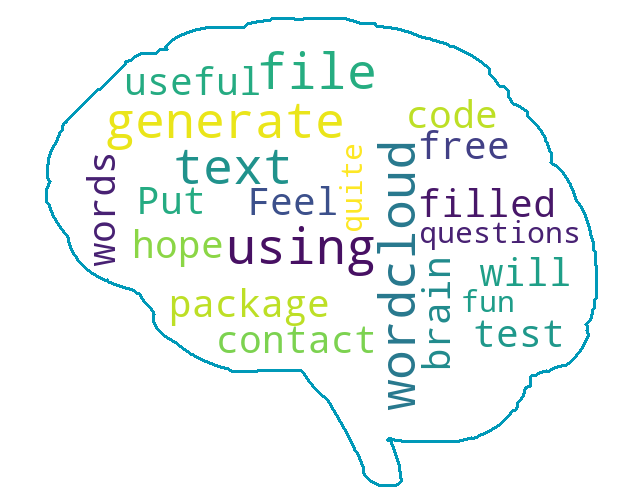

# Generating a brain filled with words (based on frequency)

This code makes use of the wordcloud package in Python to generate a brain filled with words in the txt file.
The size & appearance of a word depends on the word frequency. More details here: https://amueller.github.io/word_cloud/index.html

The attached code used with the attached templates will generate this brain:

Modify the .txt file to change the input words. Modify the brain_mask.png to get another border.

